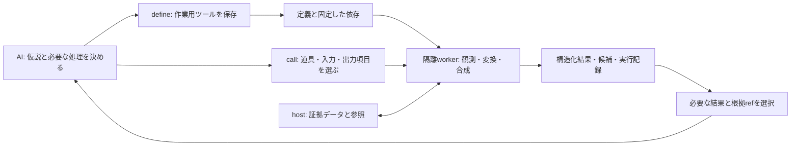

# AIが自分の作業用ツールを生成・合成するためのPLAN

設計基準: 2026-09-27、`main / fbf2798`。状態: **未実装の設計案**。
入力: 今回添付された計画、この会話、現行コード。リポジトリ直下の別件`PLAN.md`は変更しない。

## 1. 再検討の結論

前の計画では目的を十分に満たしていない。証拠・競合・回復の設計としては有効だが、AIによるツール生成を最後の条件付き機能に置き、最初の納品を安全性の補強だけに絞っていた。

今回の目的は、**AIが必要な処理をその場でプログラムにし、証拠を直接入力して実行・合成・再利用し、次の判断に必要な結果だけを受け取れる作業環境**を作ることである。

「完全にAI側に都合が良い」は、操作設計の基準をAIの作業に置くという意味で採用する。すべてのモデル・タスクで最適だという性能保証にはしない。ファイルやプロセスは実際の変更対象として残るが、モデルにその低水準の取り回しを毎回担当させない。

旧計画の安全性条件は実行基盤の不変条件として残す。**生成・実行・合成・再利用の実例が初回リリースで動かなければ、この計画は未達**とする。

### 新計画でも避けるべき偏り

1. **Lispを使うこと自体をAI向け設計と取り違える。** Lispは生成・合成のための実行言語であり、製品の成果は再利用可能な作業用ツールと判断に必要な結果である。別runtimeへの移植や名前の変更は初版の要件にしない。
2. **証拠ref・digest・revisionの記帳がモデルの負担へ漏れる。** モデルが選ぶものはtoolRef、入力、必要な出力に絞る。digest・owner・世代・baseはhostが管理する。再試行を識別する短いrequest IDは既存契約との整合を保ち、同じIDで入力を変えた再送を拒否する。詳細な監査列は選択取得にする。
3. **一回一worker隔離は短い処理の起動費用を増やす。** これはM1の正しさを優先するための意図的なコストであり、定義・compile・worker起動・実行・終了を含めて測る。測定前にworker再利用やcacheを既定化しない。再利用を許す場合も、自己申告manifestだけでは状態非汚染を証明できない。
4. **既存の操作確認をすべての計算へ持ち込む。** 候補の生成・選択・比較はプログラムから完結できるようにする。一方、承認の要否は現行host policyで決まり、可逆性から推測しない。scratch内でもhost npmによる検証は既存承認を維持する。

## 2. AIの作業を基準にした設計

| AI側の負担 | 今回の設計判断 | 誤った代替 |
| --- | --- | --- |
| 読む→抜き出す→別ツールへ転記する | 大きいデータはhost/workerに置き、参照を直接渡す | catの結果を短いJSONに包むだけ |
| 決定済みの処理を何度も生成する | 作業用関数をcode・契約・依存関係の組として保存して呼ぶ | コマンド履歴を再実行する |
| 一つの結論までに細かい往復を繰り返す | 必要な観測、比較、変換を一つのプログラムへ合成する | 複数の推論判断まで先回りして巨大自動処理にする |
| 大量の出力から次の判断材料を探す | 構造化結果を選択・集計して返し、原資料の参照を残す | モデル要約だけ返して原資料を捨てる |
| 関数・入力・結果の対応を会話で覚える | hostが依存関係と実行履歴を管理する | 全呼び出しでdigest・generation・rootを手入力させる |
| 仮説ごとにファイルを書き戻す | 同じ基準入力から独立した変更候補を作って比較する | 作業treeを上書きし、失敗したらrollbackする |
| contextやworkerが失われると作り直す | 定義と構造化された作業状態を残し、結果は実行せず参照する | 会話全文・Lisp heap・承認を復元する |
| 使用可能な道具のschemaが膨らむ | 小さい常設入口と、選んだ道具だけのmanifestを使う | 生成した全関数を毎turnのtool catalogに列挙する |

削減対象は単純なtool call数ではなく、**判断のない逐次往復、既出データの再送、コードの再生成、状態の再構築**である。新しい証拠の解釈、曖昧な対象の選択、権限の変更にはモデルまたはユーザーへ戻る。

### 役割の分担

- モデル: 目的の解釈、仮説、必要な観測の選択、ツールのコード生成、曖昧な結果の判断、候補の選択。
- 決定的な実行部: 読み取り、型検査、参照解決、変換、照合、許可済み検証、実行記録、差分、競合検出。
- ホスト: scope、owner、権限、承認、実行上限、再試行と回復。

`fix_bug("何とかして")`のような入口は作らない。内部で別LLMへ丸投げすることも、基本経路には含めない。ツールの生成者は今作業しているAIであり、ホストが自然言語の仕様から勝手に実装・正解・許可を推定しない。



実データはhostとworkerの間を流れ、モデルは必要な判断点で結果を見る。すでにルールが決まった反復は一回のcall内部で進め、新しい判断が必要なときだけ戻る。

## 3. 中心となる操作: 作業用ツールを生成して使う

常設のモデル向け入口は、まず次の形にする。名称・形状は新規提案であり、現行APIではない。

| 入口 | モデルが指定するもの | 得られるもの |
| --- | --- | --- |
| **`lisp_define`（新規）** | 関数本体、入出力schema、依存ツール、確認例。必要なら初回入力 | immutableな`toolRef`、検査結果、必要なら初回実行結果 |
| **`lisp_call`（新規）** | `toolRef`、JSON引数または証拠参照、必要な出力 | hostで検証された呼び出し、構造化結果、証拠・候補・検証の参照 |
| `lisp_describe`（拡張） | 選択したtoolRef、または限定された一覧条件 | 短い説明、完全schema、依存関係、利用可否 |
| `lisp_inspect`（拡張） | 保存結果ref、field/条件/範囲 | 選択済みの証拠。元操作は実行しない |
| `lisp_status`（拡張） | 省略可能な一覧条件・件数 | hostが把握する利用可能な道具、既知の結果、候補、未確定の実行、失効した参照 |
| **`lisp_apply`（候補適用段階で追加）** | host発行candidateRefとoperation ID | 既存承認を通った適用receipt |

`lisp_eval`は一回限りの実験と自由なLisp作業のために残す。既存の`cancel/reset`も残す。新経路はLispモード内で明示的に選び、既存sessionの動作を一斉に切り替えない。

`lisp_call`の外側のschemaだけでは、各関数の引数型をproviderに強制できない。選択したmanifestをモデルへ渡し、ホスト側でも個別schemaを検証する。将来、選択中のtoolだけをnative schemaへ投影する方式は比較対象にできるが、初版の依存条件にはしない。

### 作業用ツールの単位

```ts
type TaskTool = {
  toolRef: string;                  // host発行。名前だけで呼ばない
  name: string;                    // 発見用。identityではない
  description: string;
  sourceDigest: string;
  manifestDigest: string;
  runtimeApiVersion: number;
  inputSchema: JsonSchemaSubset;
  outputSchema: JsonSchemaSubset;
  dependencies: Array<{ binding: string; toolRef: string }>; // 局所名と不変な定義
  requestedCapabilities: string[];  // 宣言であり権限付与ではない
  checks: { compiled: boolean; examples: 'passed' | 'failed' | 'not-run' };
};
```

ホストはsourceも保存するが、通常応答に再掲しない。修正は新toolRefにする。同じ名前・worker generation内での再定義でも、既存toolRefの意味を変えない。依存は同じownerの正確なrefから再帰的に解決し、自己参照・循環・欠落・失効を拒否する。依存数・深さに上限を設け、確定した依存集合のdigestを保存する。別の最新版へ名前で解決し直さない。

`binding`は合成source内の局所関数名であり、globalなsymbol名ではない。hostが検査したbindingから正確な依存定義へのwrapperを作る。同名の道具が二つあっても上書きせず、同じworker内で通常の関数として呼び出す。bindingの重複・予約名を拒否し、この対応もmanifestのidentityへ含める。

初版の定義入力は**明示的なlambda本体と補助関数**に限定し、任意の評価履歴から定義を抽出しない。同梱runtimeの既知のmacroは使えるが、任意のユーザー定義macro、自由なload、未宣言のuser関数・大域変数への依存はmanaged経路の契約外とする。使いたい場合は既存persistent形態の`lisp_eval`を使う。

単なる構文上の制限で安全性や純粋性を証明できるとは扱わない。Common Lispのcompile・macro展開・初期化もコード実行である。定義と確認例は保護された実行環境で扱い、定義段階のhost書き込み・verifier・network brokerは拒否する。

初版に`pure`の自己申告fieldは設けず、任意コードの結果cacheも導入しない。保存済み結果を読み返すこと、新入力で同じ道具を呼ぶこと、結果不明の実行を再試行することを区別する。最初の二つは正確なrefと現在の権限で利用できる。結果不明の副作用は自動再実行しない。

### 使い捨て・特化・合成・再利用

- 一度だけの小処理は`lisp_eval`のlocal関数でよい。すべてに登録手続きを要求しない。
- 複数入力で使う処理や後で再開する処理を`lisp_define`する。登録と初回実行は一要求にまとめられる。
- 初回実行はcompileと指定された確認例の成功後に開始する。確認例なしは`not-run`を明示し、独立検証済みとは表示しない。
- 汎用関数を今のscope・検査項目へ特化する場合、選んだ定数・依存refをartifactに含める。任意のlive closureや暗黙の許可は保存しない。
- 関数間の合成はLispの通常の関数呼び出しで行う。中間vector・hash table・証拠refをモデルへ返して呼び直さない。
- 組み合わせ全体を一つのtoolRefとして呼べるようにする。新しいDAG言語や巨大JSON workflowは導入しない。
- 一度の成功でglobal公開・Skill化しない。初版の再利用範囲は現在のownerに限定する。

たとえば、manifestに載っていないファイルを求める部分は、次のような生成関数になる。これは新経路で登録するsourceの例であり、現行APIへそのまま送る手順ではない。

```lisp
(lambda (input)
  (coerce
    (sort (set-difference
            (coerce (gethash "files" input) 'list)
            (coerce (gethash "listed" input) 'list)
            :test #'string=)
          #'string<)
    'vector))
```

入力schemaは二つのstring array、出力schemaはstring arrayに限定する。確認例には一致・不足・空集合・重複を含める。合成toolでは観測したJSONとpath集合をこの入力へ直接変換し、不足entryから変更候補を作る。再利用時はtoolRefと入力refを渡せばよく、このsourceを再送しない。大小文字・path正規化・重複の扱いはfixtureで固定し、この短い関数だけで完全なmanifest検査を済ませたことにはしない。

## 4. データを会話経由で運ばない

作業用ツールを有用にするには、登録機能だけでなく入力・出力を直接接続する必要がある。最低限、以下のhost-ownedな部品をLispから合成できるようにする。

| 部品 | 作業単位 | 初版の範囲 |
| --- | --- | --- |
| `workspace.observe` | 複数の対象を一括取得し、必要な観測へ変換 | 明示scopeのファイル・限定glob、literal検索、JSON構造。証拠refと取得範囲を返す |
| `evidence.select` | 保存結果の必要な部分を選択・集計 | field、bounded filter、head/tail、文字列検索。自由SQLやevalを受けない |
| `changes.stage` | 観測した入力から変更候補を作る | create/replace/delete、正確な元内容、hostが付けるbase、diff |
| `checks.run` | 固定した候補またはworkspaceを検証する | 現行verifier種別・script。実行先と候補の対応を記録 |
| `results.compare` | 共通条件の候補・結果を比較する | 変更対象、diagnostics、exit、test report、未検証範囲の差分 |

これらを同数のnative toolとして常時追加する必要はない。host-ownedの登録済みtoolとLispの小さいAPIとして公開し、同じ`lisp_call`からも生成関数からも使う。

参照による受け渡しは表示上の省略だけで終わらせない。解決した大きい入力は許可済みread-onlyコピーとしてworkerへ渡し、RPC frameへ全文を詰め込まない。大きい中間結果は専用scratchからhostが検査・保存してartifact refへ変換する。出力側にもこの経路を作り、512 KiBでJSONが消える現在の経路に戻さない。再利用側は保存物を直接読み、bodyをmodelへ再送しない。容量・参照寿命・実際に保存できた範囲を必ず返す。

証拠artifactはworkerのheap参照とは別物として実装する。host管理のdataRoot配下へimmutableなbytesを保存し、refをowner・scope・種別・内容digest・取得元・有効期限へ結び付ける。ref解決時は現在の権限と保存bytesを検査し、新workerの入力へ複製する。workerの内部pathをrefとして信用しない。既存の保存結果ページングだけではこの入力経路にならないため、M1で保存・読込・容量制御まで接続する。

### 観測の範囲と一貫性

`workspace.observe`はread/glob/grepの表示文字列を結合するだけにしない。ホストで検査したbytesと観測結果を結び付け、変換・編集・比較へ同じrefを渡す。nativeの観測表示のdigestを元ファイルのdigestと取り違えない。

新しい任意host読み取り口は作らない。明示fileは現在の入力コピー検査を再利用する。globは有効なnative read/search policyを通すversion付きadapterを実装し、得た各pathを再検査する。native policyを確認できないhostではglob機能を公開せず、明示入力だけで動く。

adapterの入口は`observe(owner, request, executionContext)`相当とし、明示scope、出力budget、signalを受ける。開始時と結果確定時にowner・root・固定した実装・cancel状態を検査し、拒否・部分取得・更新中を区別して保存する。現行の汎用bridgeが転送できるのは`lisp_status`だけであり、保持されているnative read/glob/grepをそのままbroker経由で呼べるとは仮定しない。

モデルにはroot、dev/ino、実行世代、内部コピーpathを毎回指定させない。ホストが現在のownerとscopeを付与し、ref解決時にも検査する。refは権限そのものではない。

複数ファイルは同時刻のatomic snapshotとは限らない。取得した各版を固定し、少なくとも取得前後の変化を検知する。更新中なら`unstable`を返し、取得した集合を「repository全体のsnapshot」と呼ばない。

### 応答に必要な情報

```ts
type ObservationSet = {
  ref: string;
  items: Array<{ ref: string; path: string; excerpt?: string }>;
  coverage: {
    scope: string[];
    complete: boolean;
    returned: number;
    total: number | null;
    omitted: Array<{ reason: string; ref?: string }>;
  };
  consistency: 'checked' | 'unstable' | 'unknown';
};
```

出力上限は「全文を生成してから切る」だけにしない。要求されたfield、件数、範囲を取得・変換の段階へ押し下げる。総件数のためだけの全走査は不要。途中打ち切りなら`total: null`、`complete: false`とする。

空結果と「存在しない」は同義ではない。未取得・未対応parser・上限到達・権限拒否を区別する。検索が不完全なら、生成関数がabsenceを確認済みと出力しても、ホストのcoverage表示で隠せない。

symbol/reference/call graphは、対応parserがある場合の追加adapterとする。正規表現を意味解析と称さない。初版はtext/JSONで動く垂直スライスを完成させ、次にTypeScript等の限定adapterを追加する。runtime依存関係と配布サイズはその段階で明示する。

## 5. 次の判断に必要な結果を返す

生成ツールの返り値`data`と、ホストが観測した`execution/effects/verification`を分ける。生成コードが`passed: true`を返しても、ホストの検証成功にはならない。

通常応答は、結果の要点、反例・診断、候補ref、根拠ref、未完了理由を優先する。重要性をホストが自然言語から推測せず、登録schemaと呼び出し時のfield選択、host-ownedの診断adapterで決める。必要ならexactな原資料へ戻れるようにする。

```json
{
  "operationId": "host-run-ref",
  "execution": { "state": "completed" },
  "effects": { "workspace": "unchanged", "candidateRefs": ["candidate-ref"] },
  "data": { "missingEntries": ["migrations/fixture.sql"] },
  "coverage": { "complete": true },
  "evidenceRefs": ["input-ref", "comparison-ref"],
  "verification": { "state": "not-run" }
}
```

失敗は、どこまで実行済みか、残っているデータ、未実行の処理、再利用できる参照を返す。`BASE_CHANGED`等は次に取得すべき対象refも返し、エラー文からpathを拾い直す作業を減らす。ツールが提示する自然言語の提案は未信頼データであり、自動実行指示にはしない。

生成コードの確認例は、その例での動作を確認するだけ。生成元AIが作ったテストだけで修正全体を正しいとは判定しない。独立fixture、既存テスト、ユーザーの受け入れ条件を分けて報告する。

## 6. 変更候補と比較を作業用ツールの出力にする

managedな作業用ツールは、workspaceへ直接適用せずcandidateを返す。既存`lisp_eval`の適用動作は維持し、新経路の`changes.stage`だけをこの契約にする。

ホストは処理が実際に読んだ入力集合を記録し、候補へ依存関係を付ける。生成コードやモデルにdigestの手動転記を要求しない。初版は、その呼び出しで観測した集合を保守的なread-setとし、関係の薄い入力を減らすにはscopeを分ける。モデルが依存関係を削って検査を回避する口は設けない。

変更対象のbaseだけでなく、判断に使った設定・manifestの変化も検査する。globで得た集合に依存する場合は、範囲内の追加・削除も検査対象にする。初版の明示入力と、後段の集合依存を区別する。

候補は不変。A/Bを試す場合は同じ基準入力から別candidateを作り、別scratchへmaterializeする。差分の種類はファイル内容、検証結果、入力条件、coverageとする。モデルの「Aが良さそう」は候補の選択理由として扱い、実行証拠とは分ける。

別candidateの検証や生成物は使い回さない。テストのreuseは、実行条件・入力集合・script・candidateが同一とhostで検証できる場合に限る。任意Lispが`pure`と宣言したことをcache keyの正当性にしない。

候補適用は`lisp_apply`から既存`LispProposalBatch`へ接続する。candidate単位で一つの適用attemptを拘束し、別operation IDでも二重適用を拒否する。既知の全件未適用からの新attemptのみ再承認可能とし、UNKNOWN・部分適用を再試行しない。複数ファイル全体のatomicity、自動rollback、外部editorを含む完全な排他は保証しない。

### 検証は副作用を持つ

現行`ci.verify`は承認後にhost npmを実行する。scratch指定でもworker sandbox内の実行とはならない。この境界と承認は維持する。

検証attemptを親実行から独立してjournalへ保存し、ログはworkerへ返す前に保存する。process完了、exit code、test report、skip、候補との対応を別々に返す。対応reporterがなければtestStatusはunknown。親の失敗後も保存済みattemptを読めるが、workspaceのmemory application proofへ勝手に昇格させない。

ログ収集の上限到達と、表示だけの省略を分ける。現行512 KiBの返り値制限や1 MiBのCI収集上限を、無制限化だけで解決しない。

## 7. workerの寿命をAIに管理させない

保存する単位は、関数定義とschemaの`TaskTool`、固定した証拠、候補、実行receiptである。Lisp heap、実行途中のstack、承認状態は保存しない。

generation内の関数登録とtyped callだけなら追加は小さい。ただし現行も関数の定義・発見・合成は可能であり、その案だけではworker終了後の再生成と入力の再転記が残る。今回sourceと証拠の保存をM1へ含める理由は、この負担までhost側へ移すためである。

managed経路では暗黙の大域状態に依存しない。初版は**一回の合成ツール呼び出しに一つの隔離worker**を使い、その中の補助関数呼び出しは同じworkerで実行する。既存のpersistent `lisp_eval` workerをresetして流用しない。

起動器・OS保護・同梱FASL cacheは既存を再利用し、managed workerも同じ総worker数・時間・出力上限へ算入する。容量不足はBUSYを返し、別agentになりすまして枠を増やさない。定義確認のworkerも算入する。

現行`prepareAgent`はpersistent workerの存在を前提にするため、そのままでは`maxWorkers: 1`でmanaged workerを起動できない。M1でtask-tools用の明示的なsession実行形態を追加し、tool登録時に不要なpersistent workerを起動しない。新形態では`lisp_eval`の一回限りの処理も隔離実行として明示し、既存persistent形態の意味は変えない。既存sessionの関数・scratchを黙って消して切り替えない。

slot管理は`owner + execution realm + invocation ID`を内部keyとする共通管理へ切り出す。authorityは既存ownerのまま保持し、モデルに別agent IDを発行させない。`maxWorkers: 1`のtask-tools sessionでdefine→callが進み、legacy session併存時に上限を超えないことをM1の必須検査にする。

defineと初回実行を一要求へまとめても、compile用workerの停止を確認してから実行用workerの枠を取る。停止未確認なら枠を解放して次を起動しない。実行runtimeのidentityは既存`CompiledLispCache`の検証へ結び付け、managed経路だけ検証を迂回しない。

定義のload/compile時はbroker effectsを閉じ、専用scratchで実行する。hostが発行した入力と明示された依存だけを渡し、過去の任意評価を再生しない。managerの`hostCall`だけでなく、workerが直接処理するrun/start-job等の全RPC分岐も制限する。managed呼び出しでも汎用process起動は公開せず、検証は明示的な`checks.run`を通す。OS sandbox・環境変数の境界を維持し、Lisp/FFIからも権限を増やせないことを検査する。

wall time・出力・frame上限を適用する。CPUやメモリの強制上限は現行実装で保証済みとは扱わず、対象OSで設定・検証できる範囲をM0で確定する。定義確認が失敗したartifactは利用可能にせず、停止未確認はUNKNOWNのまま扱う。Common Lispの自由度から、静的に未宣言依存を完全検出したとは主張しない。clean workerで利用不能な依存は実行エラーとして可視化する。

これは起動費用が増える選択である。最初は、source・schema・環境の対応と再開の正しさを優先する。実測後に、同じartifactを使うworkerの再利用等を検討する。ただしworkerを再利用するなら、呼出間の状態汚染を観測できる回帰テストが必要であり、生成コードの自己申告だけでは許可しない。

モデルはtoolRefを呼ぶだけで、現在のworkerに定義があるかを確認・再送しなくてよい。未開始の新しい呼び出しで定義を再構築することと、UNKNOWNになった過去の呼び出しを再実行することは別である。後者はしない。

### context再開

`lisp_status`は現在のhost-bound作業範囲について、利用可能toolRef、直近の確定結果、候補、未確定attempt、失効refを短く返す。モデルが残す「次に調べたいこと」は、hostの状態と別fieldの未検証メモにする。自由な推論過程・会話全文は保存しない。

再開後は保存結果を読み、失効入力だけ取得し直す。返却済み証拠refを現在のworkspace内容へ暗黙変換しない。入力bytesを保持していない場合は、その事実を返す。actor/sessionを越える共有や既存のcontinuation state machineの置換は初版の範囲外とする。

## 8. 最初に動かす一連の例

最初のfixtureは「migrationファイル集合と配布manifestの不一致を検出し、最小変更候補を作る」とする。現repositoryの`migrations/`、`scripts/module-compatibility-assets.json`、`tests/dsh/unit/core-modules.test.ts`に対応する使い捨てfixtureを用意し、実repositoryに不具合があるとは仮定しない。

1. モデルが比較ルールを決め、`lisp_define`で`audit-migration-assets`を生成する。sourceはmanifestのJSONと限定されたSQL path集合を比較し、不一致と証拠を返す。
2. 定義検査と初回入力を同じ要求へ渡す。hostが限定scopeを観測し、関数を実行する。modelには不足entryと元資料refだけ返る。
3. モデルが修正方針を決め、`audit-migration-assets`と`prepare-asset-fix`を合成したtoolを生成する。依存は既存toolRefで指定する。
4. 合成toolは同じ入力refを直接消費して変更候補を返す。manifest本文をmodel経由で読み直したり転記したりしない。
5. 宣言したfixture一式からcandidateをmaterializeし、独立したテストを実行する。モデルは差分と検証結果を見て適用または追加調査を選ぶ。
6. `lisp_apply`がbaseとread-setを再検査し、既存承認を通す。適用後の確認は別receiptにする。
7. 別の入力集合へ同じtoolRefを呼び、コードを再生成せず再利用する。worker/contextを中断したケースでも、定義の再送や過去の変更の再実行を要求しない。

観測済みの判断をプログラムへ移すのであって、「不一致を見たらどんなものでも修正してよい」とはしない。曖昧な重複、未知のmanifest形式、scope外の依存、更新中の入力はblockerとして返す。

この例の後、二つ目は「保存ログから失敗signatureを抽出し、対応するsource/testの証拠集合を返す」生成ツールにする。タスクが変わってもhost primitivesを使って**別の道具をAI自身が作れること**を確認する。

## 9. 実コードへの接続

行番号は調査基準commitのもの。新規module名は責務の案であり、既存実装の存在を意味しない。

| 現在の部品 | 確認した契約 | 変更・流用 |
| --- | --- | --- |
| [contracts.ts](/Users/dkc/Sites/Src/kiokuko-dsh/src/dsh/lisp/contracts.ts:15) | 六つのnative tool、eval、path/content提案 | define/call、manifest、ref、候補の入力型を追加。schemaは境界で実検証 |
| [tools.lisp](/Users/dkc/Sites/Src/kiokuko-dsh/lisp/tools.lisp:52) | eval/describe/inspect、generation内の関数発見 | managed define/invoke methodとtyped codec。既存evalは保持 |
| [worker.ts](/Users/dkc/Sites/Src/kiokuko-dsh/src/dsh/lisp/worker.ts:106) | 一worker一評価、固定RPC、評価内のbroker | managed実行の同じsupervisor/sandbox、限定workspace/evidence broker、cancel伝播 |
| [manager.ts: bridge](/Users/dkc/Sites/Src/kiokuko-dsh/src/dsh/lisp/manager.ts:228) | generation・signal拘束。汎用tool bridgeはstatusのみ | scope付き観測・保存結果入力を明示adapterで追加。任意tool forwardingは禁止 |
| [manager.ts: evaluation](/Users/dkc/Sites/Src/kiokuko-dsh/src/dsh/lisp/manager.ts:403) | 入力snapshotは保存するが、提案は評価後にfreeze | snapshotsをbase/read-setへ接続。managed経路はstage-only |
| [surface.ts](/Users/dkc/Sites/Src/kiokuko-dsh/src/dsh/lisp/surface.ts:135) | agent単位の登録・実装pinning・native表示 | 固定入口の追加とfence。作成された全関数の動的native登録は初版では行わない |
| [store.ts](/Users/dkc/Sites/Src/kiokuko-dsh/src/dsh/lisp/store.ts)、[inspection.ts](/Users/dkc/Sites/Src/kiokuko-dsh/src/dsh/lisp/inspection.ts) | owner、replay、保存結果、ページング | tool artifact、検証attempt、context projection。大きい結果の直接参照 |
| [proposal-batch.ts](/Users/dkc/Sites/Src/kiokuko-dsh/src/dsh/lisp/proposal-batch.ts)、[files.ts](/Users/dkc/Sites/Src/kiokuko-dsh/src/dsh/lisp/files.ts) | 一括承認、競合検査、独立backup、部分適用 | stageしたbaseを保持して適用。read-setの再検査 |
| [ci.ts](/Users/dkc/Sites/Src/kiokuko-dsh/src/dsh/lisp/ci.ts)、[memory-verification.ts](/Users/dkc/Sites/Src/kiokuko-dsh/src/dsh/lisp/memory-verification.ts) | 固定verifier、host承認、workspace proof条件 | 独立attemptとログ、候補対象の結合。proof条件は維持 |
| [compiled-cache.ts](/Users/dkc/Sites/Src/kiokuko-dsh/src/dsh/lisp/compiled-cache.ts) | 同梱runtimeの検証済みcache | そのまま利用。user sourceを共有runtime cacheへ混ぜない |

追加責務の分離案は`task-tools.ts`（artifactとschema）、`task-execution.ts`（managed worker）、`workspace-observation.ts`（観測）、`candidate.ts`（候補）、`task-context.ts`（再開用projection）。既存managerにすべてを詰め込まない。安定した反復が見える前に汎用plugin frameworkへ広げない。

### 表現・保存・互換性

- JSON objectはstring-keyed hash table、arrayはvector、true/false/nullは別sentinel。NILを複数のJSON値へ曖昧変換しない。整数はsafe integer、実数は有限binary64。大整数はschemaでstringにする。
- schemaは限定subset、最大深さ・要素数・encoded bytesを拘束する。不正引数は実行前に拒否。返り値schema違反は実行後なので、effect receiptを残し、自動再試行しない。
- tool artifactはimmutableなsource/schema/dependenciesを保存し、operationとは別概念にする。初版は既存journalをbackendとして利用できるが、専用repository APIを設け、通常statusへsource本文を列挙しない。
- 新kindのexpiry、capacity、restart reconciliation、inspectを同時に更新する。正常artifact・結果は既存30日保持と整合させ、参照するだけで無期限延長しない。実行開始時に必要な定義・依存・証拠へ保持leaseを取り、完了までGCさせない。失効した依存があればtoolは利用不可とする。UNKNOWNに必要な証拠・復旧receipt・backupを通常TTLで削除しない。
- 新経路は別policy versionとして識別し、旧evalのreplayは保存結果を返す。今回のAPI追加を理由に旧履歴を再評価しない。
- SQL migrationが必要なら`migrations/`と`scripts/module-compatibility-assets.json`、packed/moduleの検証を同じ変更へ含める。

## 10. 実装順序と納品単位

基盤だけを何段階も先に作らない。各段階にモデルから実際に呼べる使用例を置く。

| 段階 | 実装 | 主な対象 | 完了条件 |
| --- | --- | --- | --- |
| **M0: 実行可能な契約を決める** | 二つのfixture、独立oracle、define/call/resultのschema、旧経路trace | 新規`tests/fixtures/agent-task-tools/`、対応unit test | 曖昧さ・失敗・不完全観測を含む期待結果が固定される |
| **M1: 道具を生成・合成して使い回す** | define、immutable artifact、call、隔離worker、明示入力ref、限定観測、Lisp内部合成、保存結果の直接入力 | contracts/surface/worker/manager、task-tools/task-execution、tools.lisp | audit道具を生成→検査→初回使用→**別の合成toolを生成して実行**→別入力で再利用。modelへの元データ再転記なし。生成・合成・再利用のいずれかが欠ければM1未達 |
| **M2: 道具が候補を作り検証する** | stage-only、base/read-set結合、candidate materialize、独立verification/log、明示apply | candidate/proposal-batch/files/ci/store/inspection | 生成toolが修正候補を返し、独立テスト後に既存承認で適用。古い入力・二重適用を拒否 |
| **M3: 診断と再開を軽くする** | 選択・集計、失効差分、task status、context再開、候補比較 | evidence selection、model-result/task-context、Skill | ログを再実行せず診断。中断後に道具を再生成せず続行。不明結果を再適用しない |
| **M4: 実測に基づく拡張** | 言語構造adapter、条件付きcache、必要なら並列観測や選択toolのnative schema投影 | 各adapter、runtime/pack、evaluation | 対象タスクで費用込みの改善を確認。品質を落とす方式は既定化しない |

**最初の実装依頼はM0/M1を一つの縦断範囲として扱う。** typed callだけ、registryだけ、競合検査だけの完成ではM1を完了にしない。コード変更まで含む最初の完成形はM2。

M1は読み取り・scratchのみで始めるため、旧計画の書き込み基盤全体を前提にしない。M2では安全条件も同時に通す。M3の再開用projectionとは別に、M1時点でtool sourceの保存と正確なref解決は必須。

## 11. AI側の利益をどう測るか

比較する経路は三つ。

1. 現行native read/glob/grepと通常の変更・検証。
2. 現行Lispで関数を定義・合成する経路。**一primitive一evalという不利な使い方をbaselineにしない。**
3. 新しい生成tool、参照によるデータ受け渡し、合成、再利用の経路。

| 指標 | 測り方 |
| --- | --- |
| 正しさ | 独立oracle・既存テスト、誤変更、scope違反、二重effect、未知状態の誤成功 |
| 逐次往復 | 同じ判断に到達するまでのmodel/tool turn数。host内RPC数とは分ける |
| 文脈消費 | schema・定義・説明・tool結果を含む実際の入力/output token。bytesだけをtokenと呼ばない |
| 再送量 | 同じsource/log/manifestがmodel境界を越えたbytesと回数 |
| 作業時間 | 定義、compile、worker起動、検証、再開を含めた総時間。承認待ちを別記 |
| 再利用 | 初回、二回目、別入力、再開後の総費用。break-evenとなる利用回数を観測 |
| 診断品質 | 不完全検索、壊れた入力、長いログ、複数原因で次の有効な判断へ到達できるか |
| 使い勝手 | schema誤り、ref取り違え、再定義、手動復旧・コード再生成の頻度 |

生成ツール自身が作ったテストだけで採点しない。定義時間や確認例を費用から除外しない。復旧や承認を減らしたことだけで高速化を主張しない。fixture scriptによる決定的検査と、同じmodel/configでの複数試行を分ける。

新経路のtool生成と利用は製品要件として実装する。その上で、既定経路にする対象、native schema投影、worker/cache最適化の採否を測定で決める。既存`test:lisp:efficiency`は合成JSONのサイズ回帰として残し、これ単独ではAI側の利益を実証したと扱わない。

## 12. 必須の失敗ケース

- 同名toolの再定義、依存tool変更、runtime不一致、別ownerのref、失効artifactは、別の実装へ黙って切り替えない。
- 定義・compile・確認例がbroker effectを試みても拒否。確認例の成功をhost権限に変換しない。
- workerを終了してから別workerへ大きい証拠refを渡せる。別owner・期限切れ・改変bytes・不正種別は拒否し、GCと実行開始の競合で入力を失わない。
- `maxWorkers: 1`で定義確認と初回実行が進み、停止未確認・既存workerとの併存で枠を超えない。worker直処理RPCからも定義時のeffectを起こせない。
- 生成関数が返り値schemaを破った場合、実行済みeffectを保持して失敗を返す。入力エラーと同じ再試行案内にしない。
- 空の不完全検索を不存在証明にしない。大きい出力は欠落の場所・理由を示す。
- 観測した内容AがBへ変わる、設定・manifestが変わる、glob集合に追加削除があれば候補をstaleにする。
- 候補Aを検証しBを適用する経路を拒否。全skip・未対応reporterをtest passにしない。
- 拒否、UI不在、cancel、timeout、遅延callback、worker slot不足を区別する。
- worker停止、host再起動、rename後のreceipt保存失敗でUNKNOWNを保持する。副作用・承認を再生しない。
- 新入口からnative tool fence、子session制限、late registration、PTC保護、unload時の保護を迂回できない。
- managed workerの終了時にjobを残さず、既存persistent Lispの定義やscratchを消さない。

## 13. 検証・配布と今回の確認範囲

変更単位のfocused testに加え、統合時は以下を使う。新規テストは既存Lisp suiteから到達可能にする。

```sh
npm run typecheck
npm run test:lisp
npm run test:lisp:efficiency
npm run verify:lisp:vendor
npm run build
npm run pack:check
npm run test:modules
npm run test:skill-delivery
```

protected SBCL/native DSHの確認は別に実施する。

```sh
KIOKUKO_REQUIRE_LISP_RUNTIME=1 \
KIOKUKO_DSH_PACKAGE_ROOT="$PWD/tests/fixtures/dsh-runtime/node_modules" \
npm run test:lisp
```

これに新しい決定的評価scriptと、別のモデルあり評価runnerを追加する。通常suiteのskipを実runtimeの成功と数えない。ソース、生成Skill prompt、pack済みmodule、使い捨てWebでのmodel-facing tool露出、公開後の実導入を分けて検証する。実モデルあり評価の費用・provider利用は実装時に明示する。

## 14. 実装状況（2026-09-27）

M0/M1の縦断経路は実装した。`enable-task`で既存のpersistent形態を維持したまま、生成lambdaの保存・確認例・固定依存での合成・別workerでの再利用・ownerに結び付いた`resultRef`入力・明示的なworkspace観測が動く。観測内容はモデル応答へ直接載せず、元byte列もhost側に固定する。

M2は候補のstage、同じ観測に由来するかの確認、scratchでのmaterialize、承認付き既存CI adapterへの接続、候補に結び付いたverification receipt、既存提案経路へのapplyを実装した。`lisp_apply`は検証receiptなしの適用も明示的な`not-run`として許すため、検証が必須という保証ではない。`lisp_verify`のcommand exitとtest reportは別であり、現時点で対応reporterがないため`testStatus`は`unknown`。実モデルによる一連の作業品質は未測定。

M3はowner別の簡潔なtask statusと候補のハッシュ比較、既存の保存結果inspectionを接続した。一般化した構造的検索adapter、任意の結果同士の比較、未検証メモの保存はまだない。M4のcache最適化・native schema投影は改善を示す実測がないため採用していない。既存の`test:lisp:efficiency`は合成JSONのサイズ検査であり、AI側の時間・token改善の証拠ではない。

保護されたSBCLを用いる統合試験は、生成、合成、別入力への再利用、host再起動後の利用、候補検証と適用、別候補へのverification流用拒否を確認する。統合fixtureは実CI adapterのscript選択と確認処理を通すが、npmコマンド実行部だけを制御されたrunnerへ差し替える。製品でのnpm script実行は既存CI adapterの別テストで確認する。公開済みpackageやlive modelの動作はこの検査に含まない。

ローカルの`verify:lisp:vendor`は、今回生成したものではないignoredな`lisp/vendor/mgl-pax/src/bootstrap/*.fasl`三つをmanifest外ファイルとして検出し失敗する。これらを削除・manifestへ追加して通過したとは扱わない。`pack:check`は成功し、配布物の必要ファイルと相対importを確認した。

**完了条件:** AIが一つ目の問題のために道具を生成し、それを別の入力・合成・中断後の作業に利用できること。元データを会話経由で運ばず、次の判断材料を取得できること。そして候補・検証・適用の事実を混同しないこと。
